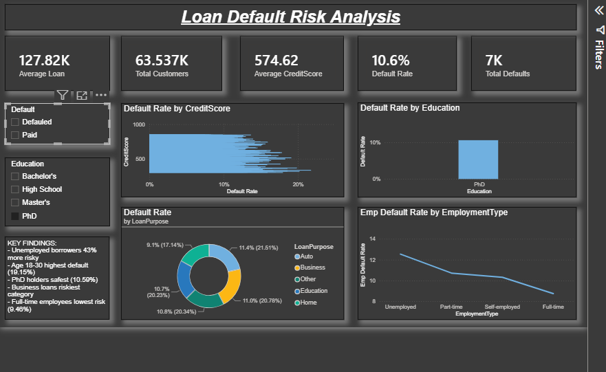

# Loan Default Risk Analysis

## Overview
Analyzed a loan portfolio of 63,500+ customers to evaluate default patterns 
across credit score, education, employment type, and loan purpose.

## Tools Used
Power BI, Excel, DAX

## Key Findings
- Overall default rate: 10.6% (7,000 total defaults out of 63,537 customers)
- Average credit score: 574.62
- PhD holders showed lowest default risk among education levels
- Unemployed borrowers were 43% more risky than average
- Age group 18-30 had the highest default rate (19.15%)
- Business loans were the riskiest loan category (20.34%)

## Dashboard Preview

## Files
- `Loan Default Risk Analysis Dashboard` - Power BI dashboard file
